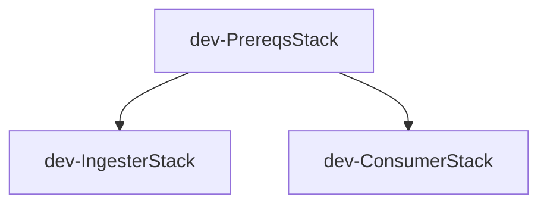

# External Ingester-Consumer Lambda Architecture

## Overview

This project implements a scalable, serverless data pipeline for ingesting CSV/TXT files from S3 into DynamoDB and exposing the data via REST API.

## System Architecture

```
┌─────────────────────────────────────────────────────────────┐
│                    SYSTEM ARCHITECTURE                       │
└─────────────────────────────────────────────────────────────┘

Ingestion Flow:
┌──────────┐      ┌──────────────┐      ┌────────────┐
│ AWS CLI  │─────>│   Ingester   │─────>│  DynamoDB  │
│  Manual  │      │    Lambda    │      │   Table    │
└──────────┘      └──────────────┘      └────────────┘
                         │
                         │ Read/Write
                         ▼
                  ┌─────────────┐
                  │  S3 Bucket  │
                  │  *.csv|txt  │
                  │  *.ingested │
                  │ *.failed.txt│
                  └─────────────┘

Consumption Flow:
┌──────────┐      ┌─────────────┐      ┌──────────┐      ┌────────────┐
│  Client  │─────>│ API Gateway │─────>│ Consumer │─────>│  DynamoDB  │
│  (HTTP)  │      │     REST    │      │  Lambda  │      │   Table    │
└──────────┘      └─────────────┘      └──────────┘      └────────────┘
                  GET /external/{partitionKey}/{sortKey}
```

## Components

### 1. Ingester Lambda

**Purpose**: Stream large CSV/TXT files from S3 and write to DynamoDB

**Key Features**:
- **Streaming Processing**: Uses `io.TextIOWrapper` for line-by-line processing
- **Constant Memory**: ~50MB usage regardless of file size (tested up to 10GB)
- **Batch Writing**: Accumulates 25 items before flushing to DynamoDB
- **Error Handling**: Creates `.failed.txt` CSV with error_reason column
- **Audit Trail**: Renames processed files with `.ingested` suffix

**Configuration**:
- Runtime: Python 3.11
- Memory: 1024 MB
- Timeout: 900 seconds (15 minutes)
- Ephemeral Storage: 2048 MB
- Reserved Concurrency: 5

**Environment Variables**:
- `S3_BUCKET`: dev-answering-procesapp-info
- `DYNAMODB_TABLE`: dev-ExternalData
- `STAGE`: dev
- `KMS_KEY_ID`: KMS key ID for encryption
- `BATCH_SIZE`: 25 (DynamoDB BatchWriteItem limit)
- `MAX_RETRIES`: 3

**Invocation Payload**:
```json
{
  "config": [
    {
      "table": "dev-ExternalData",
      "partitionKey": "doc",
      "sortKey": "fedecafetero",
      "file": "fedecafetero.csv",
      "ignore": false
    }
  ]
}
```

### 2. Consumer Lambda

**Purpose**: Query DynamoDB records via API Gateway

**Configuration**:
- Runtime: Python 3.11
- Memory: 256 MB
- Timeout: 30 seconds

**Environment Variables**:
- `DYNAMODB_TABLE`: dev-ExternalData
- `STAGE`: dev
- `KMS_KEY_ID`: KMS key ID

**Response Codes**:
- `200`: Record found
- `404`: Record not found
- `400`: Invalid request (missing parameters)
- `500`: Internal server error

### 3. DynamoDB Table

**Table Name**: `dev-ExternalData` (CapitalCase: `{Stage}-ExternalData`)

**Schema**:
```
Partition Key: partitionKey (String)
Sort Key: sortKey (String)

Attributes:
  - createdAt (String, ISO 8601)
  - sourceFile (String)
  - rowIndex (Number)
  - status (String, default: "active")
  - data_* (String, original CSV columns prefixed)
  - expirationTime (Number, optional TTL)
```

**Indexes**:
- **timestamp-index** (GSI): 
  - Partition Key: status
  - Sort Key: createdAt
  - Projection: ALL

**Configuration**:
- Billing Mode: PAY_PER_REQUEST
- Encryption: Customer Managed (KMS)
- Point-in-Time Recovery: Enabled
- TTL Attribute: expirationTime

### 4. API Gateway

**API Name**: `processapp-external-api-dev`

**Endpoint**: `GET /external/{partitionKey}/{sortKey}`

**Features**:
- REST API (not HTTP API)
- Lambda Proxy Integration
- CORS Enabled
- CloudWatch Logging: INFO level
- X-Ray Tracing: Enabled
- Metrics: Enabled

**Example Request**:
```bash
curl -X GET "https://API_ID.execute-api.us-east-1.amazonaws.com/dev/external/doc-123/fedecafetero"
```

**Example Response** (200 OK):
```json
{
  "data": {
    "partitionKey": "doc-123",
    "sortKey": "fedecafetero",
    "createdAt": "2024-12-31T12:00:00.000Z",
    "sourceFile": "fedecafetero.csv",
    "rowIndex": 1,
    "status": "active",
    "data_doc": "doc-123",
    "data_name": "John Doe",
    "data_value": "100"
  },
  "status": "success"
}
```

### 5. KMS Key

**Alias**: `alias/processapp-external-data-dev`

**Purpose**: Encrypt DynamoDB table and S3 objects

**Key Policy**:
- Account root: Full permissions
- Lambda service: Encrypt/Decrypt
- DynamoDB service: Encrypt/Decrypt/CreateGrant

**Configuration**:
- Key Rotation: Enabled
- Pending Deletion: 7 days (dev), 30 days (prod)

## Data Flow

### Ingestion Flow (Streaming)

1. **AWS CLI Invocation**
   - User invokes ingester Lambda with config payload
   - Config specifies: table, partitionKey column, sortKey value, file name

2. **S3 Streaming**
   - Lambda opens S3 object as streaming body (`get_object()`)
   - Wraps in `io.TextIOWrapper` for line-by-line reading
   - No full file download to memory or disk

3. **CSV Parsing**
   - Uses `csv.DictReader` (generator pattern)
   - Reads one row at a time
   - Validates partition key existence

4. **Batch Accumulation**
   - Accumulates 25 items in memory
   - Flushes to DynamoDB when batch is full
   - Repeats until end of file

5. **DynamoDB Write**
   - Uses `BatchWriteItem` API (25 items per call)
   - Implements exponential backoff retry (3 attempts)
   - Handles unprocessed items from throttling

6. **Error Handling**
   - Catches errors per row (doesn't fail entire file)
   - Accumulates error records with `error_reason`
   - Writes `.failed.txt` CSV to S3 at end

7. **File Renaming**
   - Copies original file with `.ingested` suffix
   - Deletes original file
   - Prevents duplicate processing

### Query Flow

1. **HTTP Request**
   - Client sends GET request to API Gateway
   - Path parameters: `{partitionKey}`, `{sortKey}`

2. **Lambda Invocation**
   - API Gateway invokes consumer Lambda
   - Passes path parameters in event

3. **DynamoDB Query**
   - Lambda uses `get_item()` with composite key
   - Decrypts data using KMS key

4. **Response Formatting**
   - Serializes DynamoDB item (handles Decimal types)
   - Returns JSON with CORS headers
   - Proper status codes (200, 404, 500)

## Streaming Architecture Details

### Memory Efficiency

**Traditional Approach** (Bad):
```python
# Downloads entire file to memory
file_content = s3_client.get_object(Bucket=bucket, Key=key)['Body'].read()
# Memory usage: SIZE_OF_FILE

# Parse entire CSV at once
records = list(csv.DictReader(io.StringIO(file_content)))
# Memory usage: SIZE_OF_FILE + SIZE_OF_RECORDS
```

**Streaming Approach** (Good):
```python
# Stream file from S3
response = s3_client.get_object(Bucket=bucket, Key=key)
stream = io.TextIOWrapper(response['Body'], encoding='utf-8')
# Memory usage: ~64KB buffer

# Process line-by-line
reader = csv.DictReader(stream)  # Generator
for row in reader:
    # Process row
    # Memory usage: ~1KB per row + batch (25 items)
```

**Result**: 
- 10GB file: ~50MB memory (200x reduction)
- 100MB file: ~50MB memory (2x reduction)
- 1KB file: ~50MB memory (same)

### Batch Processing

**Why batch?**
- DynamoDB `BatchWriteItem` accepts up to 25 items
- Individual `PutItem` calls: 25 API calls, 25x cost
- Batch approach: 1 API call, 1x cost

**Implementation**:
```python
batch = []
for row in reader:
    item = process_row(row)
    batch.append(item)
    
    if len(batch) >= 25:
        batch_write_with_retry(table, batch)
        batch.clear()

# Flush remaining items
if batch:
    batch_write_with_retry(table, batch)
```

### Error Resilience

**Exponential Backoff**:
```python
for attempt in range(MAX_RETRIES):
    try:
        response = batch_write_item(request_items)
        
        unprocessed = response.get('UnprocessedItems', {})
        if not unprocessed:
            return SUCCESS
        
        request_items = unprocessed
        time.sleep(2 ** attempt)  # 1s, 2s, 4s
    except Exception as e:
        if attempt == MAX_RETRIES - 1:
            return FAILURE
        time.sleep(2 ** attempt)
```

## IAM Permissions

### Ingester Lambda Role

**Permissions**:
- **S3**: GetObject, PutObject, DeleteObject, ListBucket
- **DynamoDB**: PutItem, BatchWriteItem, UpdateItem
- **KMS**: Decrypt, Encrypt, GenerateDataKey, DescribeKey
- **CloudWatch Logs**: CreateLogGroup, CreateLogStream, PutLogEvents
- **X-Ray**: PutTraceSegments, PutTelemetryRecords

**Policy Structure**:
```json
{
  "Version": "2012-10-17",
  "Statement": [
    {
      "Sid": "AccessS3Bucket",
      "Effect": "Allow",
      "Action": [
        "s3:GetObject",
        "s3:PutObject",
        "s3:DeleteObject",
        "s3:ListBucket"
      ],
      "Resource": [
        "arn:aws:s3:::dev-answering-procesapp-info",
        "arn:aws:s3:::dev-answering-procesapp-info/*"
      ]
    }
  ]
}
```

### Consumer Lambda Role

**Permissions**:
- **DynamoDB**: GetItem, Query, Scan
- **KMS**: Decrypt, DescribeKey
- **CloudWatch Logs**: CreateLogGroup, CreateLogStream, PutLogEvents
- **X-Ray**: PutTraceSegments, PutTelemetryRecords

## Security

### Encryption at Rest

- **DynamoDB**: Customer-managed KMS encryption
- **S3**: Server-side encryption (bucket default)
- **Lambda Environment Variables**: KMS encrypted

### Encryption in Transit

- **API Gateway**: HTTPS only
- **Lambda to DynamoDB**: TLS 1.2+
- **Lambda to S3**: TLS 1.2+

### Access Control

- **API Gateway**: Public (no authentication)
  - Can add API keys, Cognito, or Lambda authorizers
- **Lambda Invocation**: IAM permissions required
- **DynamoDB**: IAM role-based access only

### Least Privilege

- Ingester role: Write-only to DynamoDB
- Consumer role: Read-only from DynamoDB
- No cross-account access

## Performance

### Latency

- **Ingester**: 
  - Small files (<1MB): ~2-5 seconds
  - Medium files (10-100MB): ~30-180 seconds
  - Large files (1-10GB): ~10-15 minutes
  - Throughput: ~1000 rows/second

- **Consumer**:
  - DynamoDB GetItem: ~5-10ms
  - Lambda execution: ~50-100ms
  - API Gateway overhead: ~10-20ms
  - **Total**: ~100-200ms (p50), ~300-500ms (p99)

### Scalability

- **Ingester**: Reserved concurrency = 5 (prevents runaway costs)
- **Consumer**: Auto-scaling (no reserved concurrency)
- **DynamoDB**: PAY_PER_REQUEST (auto-scales to millions of requests)
- **API Gateway**: Default limits (10,000 req/sec)

### Throughput

- **Ingester**: 5 concurrent executions × 1000 rows/sec = 5000 rows/sec max
- **Consumer**: 10,000 API calls/sec (API Gateway limit)
- **DynamoDB**: Unlimited (PAY_PER_REQUEST mode)

## Cost Analysis

### Monthly Cost (Dev Environment)

**Assumptions**:
- 100 ingestions/day (3,000/month)
- Average file size: 10MB (1,000 rows)
- 1,000 API calls/day (30,000/month)
- 100,000 DynamoDB records total

**Breakdown**:
- **Lambda Ingester**: 
  - Requests: 3,000 × $0.20/M = $0.60
  - Duration: 3,000 × 30s × 1024MB × $0.0000166667/GB-s = $1.70
  - **Total**: $2.30/month

- **Lambda Consumer**: 
  - Requests: 30,000 × $0.20/M = $6.00
  - Duration: 30,000 × 0.1s × 256MB × $0.0000166667/GB-s = $0.13
  - **Total**: $6.13/month

- **DynamoDB**:
  - Writes: 3M items/month × $1.25/M = $3.75
  - Reads: 30K items/month × $0.25/M = $0.008
  - Storage: 0.5GB × $0.25/GB = $0.13
  - **Total**: $3.89/month

- **API Gateway**:
  - Requests: 30K × $3.50/M = $0.11
  - **Total**: $0.11/month

- **S3**:
  - Storage: 1GB × $0.023/GB = $0.02
  - Requests: 6K × $0.0004/1K = $2.40
  - **Total**: $2.42/month

- **KMS**:
  - Key: $1.00/month
  - Requests: 3M × $0.03/10K = $9.00
  - **Total**: $10.00/month

**TOTAL: ~$25/month** (dev environment, light usage)

**Production scaling**:
- 10x traffic: ~$180/month
- 100x traffic: ~$1,500/month

## Monitoring

### CloudWatch Metrics

**Ingester Lambda**:
- Duration (ms)
- MemoryUsed (MB)
- Errors (count)
- Throttles (count)
- IteratorAge (ms, if using streams)

**Consumer Lambda**:
- Duration (ms)
- Invocations (count)
- Errors (count)
- ConcurrentExecutions (count)

**DynamoDB**:
- ConsumedReadCapacityUnits
- ConsumedWriteCapacityUnits
- UserErrors (count)
- SystemErrors (count)

**API Gateway**:
- Count (requests)
- IntegrationLatency (ms)
- Latency (ms)
- 4XXError (count)
- 5XXError (count)

### CloudWatch Alarms (Recommended)

```yaml
Ingester:
  - Error rate > 5%
  - Duration > 14 minutes (approaching timeout)
  - Throttles > 0

Consumer:
  - Error rate > 1%
  - Duration > 25 seconds
  - 5XX errors > 10/minute

DynamoDB:
  - UserErrors > 100/minute
  - SystemErrors > 0

API Gateway:
  - 5XX errors > 10/minute
  - Latency p99 > 1 second
```

### X-Ray Tracing

Both Lambda functions have X-Ray enabled for distributed tracing:
- Service map visualization
- Request timeline analysis
- Error root cause analysis

## Deployment

### CDK Stacks

1. **dev-PrereqsStack**
   - DynamoDB table: dev-ExternalData
   - KMS key: alias/processapp-external-data-dev
   - IAM roles: ingester-role-dev, consumer-role-dev
   - Dependencies: None

2. **dev-IngesterStack**
   - Lambda function: processapp-ingester-dev
   - Dependencies: dev-PrereqsStack

3. **dev-ConsumerStack**
   - Lambda function: processapp-consumer-dev
   - API Gateway: processapp-external-api-dev
   - Dependencies: dev-PrereqsStack

### Stack Dependencies



### Deployment Command

```bash
cdk deploy --all --profile ans-super --require-approval never
```

### Rollback Strategy

```bash
# Rollback consumer (no data loss)
cdk destroy dev-ConsumerStack

# Rollback ingester (no data loss)
cdk destroy dev-IngesterStack

# Rollback prereqs (data loss warning!)
cdk destroy dev-PrereqsStack
```

## Future Enhancements

1. **EventBridge Automation**
   - Trigger ingester automatically on S3 file upload
   - Remove manual AWS CLI invocation

2. **SQS Queue**
   - Buffer large ingestion workloads
   - Handle backpressure during DynamoDB throttling

3. **Multi-Region**
   - Deploy to us-east-2, us-west-2
   - DynamoDB Global Tables for replication

4. **CloudWatch Dashboard**
   - Centralized monitoring view
   - Custom metrics and alarms

5. **Data Validation**
   - JSON Schema validation before DynamoDB write
   - Custom validation rules per file type

6. **Lambda Layers**
   - Shared utilities across ingester/consumer
   - Reduce deployment package size

7. **Athena Integration**
   - Query raw S3 files directly
   - Analytics without ingestion

8. **Authentication**
   - API Gateway API keys
   - Cognito user pools
   - Lambda authorizers

## License

MIT
